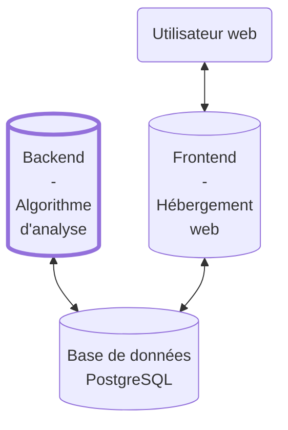
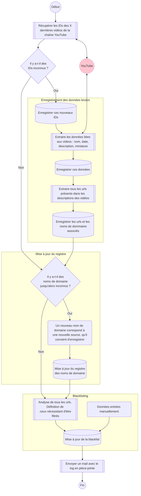

# Sources Hugo Décrypte - backend

Ce répertoire contient le code source de la partie backend du projet "Sources Hugo Décrypte". Cette partie backend à pour rôle d'analyser les données accessibles sur YouTube et de les stocker dans une base de données en serveur. Les données sont ensuite présentées côté frontend, sur le site web [sourceshugodecrypte.fr](https://sourceshugodecrypte.fr).

La partie backend interagit directement avec la base de données et n'est jamais accessible par l'utilisateur, comme présenté sur le schéma suivant :

Pour en savoir plus sur la partie frontend du projet : [Sources Hugo Décrypte - frontend](https://github.com/Sources-Hugo-Decrypte/sources-hugo-decrypte-web#readme)

## Base de données

La base de données (PostgreSQL) contient 6 tables structurées de la manière suivante :

- **video_table**

  Cette table contient les informations relatives aux vidéos YouTube.

  | Colonne           | Type                  | Description |
  | -----------       | -----------           | ----------- |
  | ***video_id***    | text *(primary key)*  | ID unique de la vidéo attribué par YouTube (XXXX dans l'url "www.youtube.com/watch?v=XXXX") |
  | ***video_name***  | text                  | Nom de la vidéo |
  | ***video_date***  | timestamp             | Date de publication de la vidéo |
  | ***video_img***   | text                  | Url de la miniature de la vidéo |
  | ***video_desc***  | text                  | Description complète de la vidéo |

- **url_table**

  Cette table renseigne tous les urls cités dans la description de chaque vidéo.

  | Colonne           | Type                            | Description |
  | -----------       | -----------                     | ----------- |
  | ***url_video_id***| text *(composite primary key)*  | ID de la vidéo YouTube associée à cet url |
  | ***url_full***    | text *(composite primary key)*  | Url complet |
  | ***url_short***   | text                            | Nom de domaine de l'url |

- **register_table**

  Cette table permet de faire le lien entre différents noms de domaine correspondant à la même source.

  | Colonne                   | Type                  | Description |
  | -----------               | -----------           | ----------- |
  | ***register_url_short***  | text *(primary key)*  | Nom de domaine (ex : [www.actu.fr](www.actu.fr), [www.lemonde.fr](www.lemonde.fr), [info.lemonde.fr](info.lemonde.fr)) |
  | ***register_common_name***| text                  | Nom de domaine raccourci (ex : [actu.fr](actu.fr), [lemonde.fr](lemonde.fr), [lemonde.fr](info.lemonde.fr)) |

- **links_ytb_table**

  Cette table donne des détails sur les liens YouTube présents dans les descriptions des vidéos.

  | Colonne                 | Type                            | Description |
  | -----------             | -----------                     | ----------- |
  | ***links_ytb_url***     | text *(composite primary key)*  | Url complet |
  | ***links_ytb_channel*** | text                            | Nom de la chaîne YouTube à l'origine de cette vidéo |
  | ***links_ytb_msg***     | text                            | Message d'analyse de l'url |

- **blacklist_ytb_channel_table**

  Cette table renseigne toutes les chaînes YouTube filtrées.

  | Colonne                 | Type                                        | Description |
  | -----------             | -----------                                 | ----------- |
  | ***blacklist_ytb_channel_name***   | text *(composite primary key)*   | Nom de la chaîne |
  | ***blacklist_ytb_channel_reason*** | text *(constraint not null)*     | Justification. Il est nécessaire de fournir une raison pour ajouter une chaîne à cette blacklist |

- **blacklist_table**

  Blacklist principale. Tous les noms de domaines et les urls filtrés sont présents dans cette table.

  | Colonne                 | Type                             | Description |
  | -----------             | -----------                      | ----------- |
  | ***blacklist_url***     | text *(composite primary key)*   | Url complet ou nom de domaine |
  | ***blacklist_reason***  | text *(constraint not null)*     | Justification. Il est nécessaire de fournir une raison pour ajouter une chaîne à la blacklist |

## Algorithme

L'algorithme backend a pour but de mettre à jour cette base. Il est constitué de 3 phases principales :
- La collecte et l'enregistrement des données brutes
- La mise à jour de la table "registre"
- La mise à jour de la blacklist

C'est en s'appuyant sur les registres et la blacklist que le côté frontend effectue des requêtes pertinentes sur la base de données.

L'algorithme backend est en étroite relation avec la base de données et son exécution est assuré de manière quotidienne, grâce à un GitHub workflow.

Voici un schéma présentant le déroulement de cet algorithme de manière simplifiée (les 3 parties principales sont encadrées en jaune) :

## Améliorations

La structure actuelle de la base de données et de l'algorithme a toutefois quelques défauts :
- Les urls raccourcis (avec des shortener comme bit.ly ou p.dm) sont considérés tels quels.
- Certains urls demandent un travail approfondi. C'est le cas des urls YouTube ou Twitter par exemple, un lien vers une vidéo ou un tweet sur lequel s'appuie la présentation d'Hugo Décrypte doit être considéré comme une source, mais dans le cas contraire il doit être filtré. Ce tri a été effectué pour de nombreux liens mais il reste du travail.

Nous travaillons actuellement sur la correction de ces défauts. Aussi, n'hésitez pas à nous remonter toute proposition en lien avec ces sujets ou sur le projet en général ! 😉
